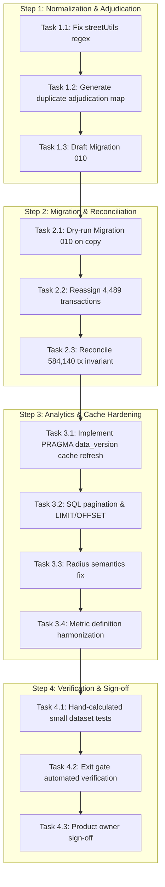

# Phase 2 Implementation Plan: Dataset Reconciliation & Analytics Correctness

**Document Version:** 1.0.0  
**Target Release:** Singapore Home Intel (October 2026)  
**Parent Plan:** [`GO_LIVE_REMEDIATION_PLAN_2026-10-02.md`](file:///c:/Dev/my-property-SG/GO_LIVE_REMEDIATION_PLAN_2026-10-02.md)  
**Reference Report:** [`GO_LIVE_READINESS_REPORT_2026-10-02.md`](file:///c:/Dev/my-property-SG/GO_LIVE_READINESS_REPORT_2026-10-02.md)  
**Accountable Roles:** Backend / Data Engineer with Product Owner  
**Effort Estimate:** 5–8 focused engineering days  
**Target Findings:** GL-04, GL-05, GL-06, GL-07, GL-08  

---

## 1. Executive Summary & Phase 2 Objectives

Phase 1 established startup safety, serialized migrations, and scheduled job lock isolation. **Phase 2 focuses on data truth and analytical correctness.**

Currently, the production database (`server/property.db`) contains subtle but critical data defects:
1. **Street Normalization Flaw:** `\bST\b` is blindly converted to `STREET`, creating 35 duplicate candidate groups (70 project records) where projects on "ST. ..." (e.g., *St. Thomas Walk*, *St. Michael's Road*) are split into two project entries, stranding 842 sales caveats and 3,647 rental leases across fractured identities.
2. **Transaction Collision across Streets:** Ingestion hashes omit street identity, suppressing legitimate transactions when different projects share the same name within a district.
3. **Classification & Spatial Anomalies:** 1 non-landed project is incorrectly marked as a landed aggregate; 3,076 projects have generic region `"Central"` and 90+ projects have street names mistakenly stored in `planning_area`; all 200 `district_centre` approximate coordinate records receive location-sensitive livability scores.
4. **Analytics Cache & Query Gaps:** Background syncs do not invalidate API server in-memory caches across processes; price scatter queries ignore requested `page`/`limit` and return identical records; radius searches silently truncate at 200 projects; headline gross yield divides median rent psf by the average of project sale psf instead of computing an authentic yield distribution.

### Phase 2 Goals
* Reconcile all project and transaction identities without data loss.
* Unify the 35 fractured project groups and reassign all 4,489 associated transactions under atomic SQLite migrations.
* Correct street normalization, landed classification, and planning area cataloging.
* Implement process-agnostic cache invalidation (`PRAGMA data_version`).
* Eliminate hardcoded query caps and implement deterministic SQL pagination and spatial bounding.
* Mathematically harmonize gross yield, sample thresholds, and missing-value contracts across UI, drawer, and emails.
* Suppress precise scoring on approximate coordinates and quarantine unverified SORA/amenity claims.

---

## 2. Workstream Breakdown & Technical Specifications

```
┌──────────────────────────────────────────────────────────────────────────┐
│                             PHASE 2 WORKSTREAMS                          │
├────────────────────────────────┬─────────────────────────────────────────┤
│ Workstream A: Data Identity    │ Workstream B: Query Engine & Caching    │
│  - Saint vs Street fix         │  - PRAGMA data_version cache refresh    │
│  - 35 duplicate groups merge   │  - Disjoint SQL price pagination        │
│  - Landed flag repair          │  - Complete radius query semantics      │
│  - Planning area sanitation    │  - Unit-size filter consistency         │
├────────────────────────────────┼─────────────────────────────────────────┤
│ Workstream C: Metric Contracts │ Workstream D: Provenance & Gating       │
│  - Gross yield formula spec    │  - Suppress district_centre livability  │
│  - Historical vs current psf   │  - Unify amenity distance methodology   │
│  - Sample threshold (>=3)      │  - Remove destructive SORA truncation   │
│  - Null/zero value contract    │  - UI badge & provenance disclosures    │
└────────────────────────────────┴─────────────────────────────────────────┘
```

---

### Workstream A: Data Identity, Normalization & Catalog Repair (GL-04, GL-05)

#### Task A.1: Fix Street Name Normalization (`server/utils/streetUtils.js`)
* **Root Cause:** Line 19 of `server/utils/streetUtils.js` defines `[/\bST\b/g, 'STREET']`. In Singapore, "ST" as a prefix followed by a name or dot (`ST.`, `ST `) represents **"SAINT"** (e.g. *St. Michael's Road*, *St. Thomas Walk*, *St. George's Road*, *St. Patrick's Road*). Only as a terminal suffix or when following a street proper name does "ST" denote **"STREET"**.
* **Remediation:**
  1. Replace blanket `\bST\b` expansion with contextual regex:
     - Prefix: `/\bST\.?\s+(?=[A-Z])/gi` $\to$ `'SAINT '`
     - Suffix/Stand-alone: `/(?<=\b[A-Z]+\s+)ST\b/gi` $\to$ `'STREET'`
  2. Preserve dot normalization so both `"ST. THOMAS WALK"` and `"ST THOMAS WALK"` map canonically to `"SAINT THOMAS WALK"`.
  3. Verify idempotency across all 5,938 street names in the catalog.

#### Task A.2: Adjudicate & Migrate the 35 Duplicate Project Candidate Groups
* **Evidence:** In `market-snapshot.db`, 35 groups (70 projects) exist where one project has street `"ST. ..."` (lower `project_id`, 842 total sales) and the other has `"STREET. ..."` (higher `project_id`, 3,647 total rentals).
  * Example: Project 700 (`8 SAINT THOMAS`, street `ST. THOMAS WALK`, 22 sales, 0 rentals) vs Project 3721 (`8 SAINT THOMAS`, street `STREET. THOMAS WALK`, 20 sales, 429 rentals).
* **Adjudication Strategy:**
  1. Generate an explicit, auditable migration mapping file: `server/migrations/data/project_adjudication_map.json`.
  2. For each pair:
     - Retain the canonical `project_id` (the authoritative SVY21 geocoded master row).
     - Standardize `street_name` to the canonical form (`SAINT ...`).
     - If one project had `geo_source = 'svy21'` and the other was `NULL`, copy coordinates to the survivor.
  3. Execute an atomic schema migration (`010_reconcile_duplicate_projects.js`):
     - Update `property_transactions SET project_id = :target_id WHERE project_id = :source_id;`
     - Update `rental_transactions SET project_id = :target_id WHERE project_id = :source_id;`
     - Merge `project_benchmarks` and delete orphaned benchmark rows.
     - Delete redundant `projects` rows.
  4. Ensure SQLite foreign key checks pass with `PRAGMA foreign_key_check;`.

#### Task A.3: Ingestion Transaction Deduplication Hardening (`server/ingestion.js`)
* **Root Cause:** Ingestion functions (`generateTxHash` and `generateRentHash`) previously hashed only `(projectName, district, ...)`, omitting `streetName`. Where two distinct projects share a name in the same district, identical transactions collided.
* **Remediation:**
  1. Explicitly include canonical `street_name` and `project_id` in hash seeds:
     $$\text{tx\_hash} = \text{SHA256}(\text{projectName} \parallel \text{streetName} \parallel \text{contractDate} \parallel \text{price} \parallel \text{area} \parallel \text{floor} \parallel \text{unitIndex} \parallel \text{propertyType} \parallel \text{district})$$
  2. Scope deletions during batch ingest: Never execute blanket `DELETE FROM property_transactions WHERE project_id = ?`. Ingestion must only replace records within the validated quarterly or monthly window being imported.

#### Task A.4: Repair Landed Flag (`server/utils/streetUtils.js` & Migration)
* **Root Cause:** `isLandedDevelopment()` tests `name.includes('LANDED HOUSING')`. Project 2986 `"NON-LANDED HOUSING DEVELOPMENT"` on `"SYED ALWI ROAD"` contains this substring, erroneously flagging it as a landed aggregate (`is_landed_aggregate = 1`).
* **Remediation:**
  1. Update `isLandedDevelopment` to explicitly guard against `"NON-LANDED"` prefixes:
     ```javascript
     if (name.includes('NON-LANDED')) return false;
     ```
  2. Add database repair statement in migration:
     ```sql
     UPDATE projects SET is_landed_aggregate = 0 WHERE project_name LIKE '%NON-LANDED%';
     ```

#### Task A.5: Clean & Standardize Planning Areas
* **Observed Defect:** 3,076 projects are tagged with regional label `"Central"`; 90+ projects have street names (e.g. `"PASIR PANJANG ROAD"`, `"BALESTIER ROAD"`) in `planning_area`; 2,510 have `NULL`.
* **Remediation:**
  1. Build an authoritative postal-district to planning-area lookup table for Singapore's 55 URA Master Plan Planning Areas (e.g. *Downtown Core*, *Bukit Timah*, *Novena*, *Queenstown*, *Marine Parade*, *Bedok*, etc.).
  2. For projects where `planning_area` is currently a street name or generic `"Central"`, re-map to the authoritative planning area using coordinates (point-in-polygon or district mapping).
  3. Where an unambiguous planning area cannot be determined, set to `NULL` (unknown) rather than an invalid street name.

---

### Workstream B: Query Engine, Pagination & Cross-Process Freshness (GL-06)

#### Task B.1: Inter-Process Cache Invalidation via `PRAGMA data_version`
* **Root Cause:** `queryEngine.js` keeps module-scoped in-memory caches (`saleValuationsCache`, `analyticsQueryCache`). When background cron jobs (`sync-ura.js`) update SQLite, the Express HTTP process is unaware and serves stale data indefinitely.
* **Architecture:**
  ```
  Background Sync / Rebuild                   API Server Process (Express)
  ┌───────────────────────┐                  ┌────────────────────────────┐
  │ Writes to property.db │                  │ Before servicing request:  │
  │ WAL commit bumps DB   │                  │ Query `PRAGMA data_version`│
  │ `data_version`        │                  │ Has version incremented?   │
  └───────────┬───────────┘                  └─────────────┬──────────────┘
              │                                            │
              ▼                                            ▼
     [ SQLite Database ] ──────────────► If yes: clear in-memory caches &
     (WAL Data Version)                  re-populate benchmarks (<2ms)
  ```
* **Implementation:**
  1. Introduce lightweight version check helper in `server/queryEngine.js`:
     ```javascript
     let lastObservedDataVersion = null;
     export async function ensureCacheFreshness(conn) {
       const row = await conn.get('PRAGMA data_version');
       const currentVersion = row ? row.data_version : 0;
       if (lastObservedDataVersion !== null && currentVersion !== lastObservedDataVersion) {
         invalidateAnalyticsCache();
         await initSaleValuationsCache(conn);
       }
       lastObservedDataVersion = currentVersion;
     }
     ```
  2. Wire `ensureCacheFreshness()` into `getPriceAnalytics`, `getRentalAnalytics`, and `getProjectSaleValuation`.

#### Task B.2: True SQL Pagination & Stable Ordering for Price Analytics
* **Root Cause:** `getPriceAnalytics()` scatter query (`server/queryEngine.js:534`) has hardcoded `LIMIT 200`, ignoring requested `page` and `limit`. Page 1 and Page 2 return identical data.
* **Remediation:**
  1. Add proper pagination parameters to scatter query:
     ```sql
     SELECT t.transaction_id AS id, ...
     FROM property_transactions t
     JOIN projects p ON t.project_id = p.project_id
     ${sqlWhere}
     ORDER BY t.contract_date DESC, t.transaction_id DESC
     LIMIT ? OFFSET ?
     ```
  2. Sanitize inputs: `limit` bounded between 1 and 500 (default 100); `offset = (sanitizedPage - 1) * sanitizedLimit`.
  3. Include total count and pagination metadata in response:
     ```json
     {
       "page": 2,
       "limit": 100,
       "totalRecords": 1845,
       "totalPages": 19,
       "scatter": [...]
     }
     ```

#### Task B.3: Complete Radius Semantics & Bounded Spatial Queries
* **Root Cause:** `getMatchingProjectIdsByRadius()` in `server/queryEngine.js:127` applies `.slice(0, maxProjects)` with default `maxProjects = 200`. In a 10 km query, 4,481 projects qualify, but 4,281 are silently dropped, skewing market averages and omitting map pins.
* **Remediation:**
  1. Remove artificial silent truncation for standard analytical aggregation queries.
  2. For spatial search endpoints that feed the map:
     - If the result set exceeds 1,000 projects, return cluster centroids or require the client to narrow the radius, returning an explicit status:
       ```json
       { "truncated": false, "totalMatching": 4481, "projectIds": [...] }
       ```
     - Never silently drop records used in summary aggregations (`totalVolume`, `medianPrice`, `medianPsft`).
  3. Exclude `geo_source = 'district_centre'` from radius matching (already specified, but enforce rigorously).

#### Task B.4: Harmonize Unit-Size & Bedroom Filters in Rental Analytics
* **Defect:** `getRentalAnalytics` advertises floor area range / unit-size filters, but does not apply them consistently across all 6 CTE queries (summary, matching sales, time series, bedroom breakdown, caveats table, map).
* **Remediation:** Ensure `areaMin` and `areaMax` conditions are applied to `rental_transactions.floor_area_sqft_band` or derived `area_sqft` uniformly across all sub-queries.

---

### Workstream C: Metric Contract & Valuation Mathematics Harmonization (GL-07)

#### Task C.1: Harmonize Headline Gross Rental Yield
* **The Problem:** Line 860 and 947 of `server/queryEngine.js` compute headline rental yield by taking:
  $$\text{Headline Yield} = \frac{\text{Filtered Median Rental PSF} \times 12}{\text{Average of 24m Project Median Sale PSFs}} \times 100$$
  This conflates an aggregate ratio with an average of project yields, producing misleading figures when the distribution of rentals is skewed towards different projects than the sales.
* **Agreed Specification Options (for Product Owner sign-off):**
  * **Option A (Recommended — Weighted True Yield):**
    Compute gross yield per development for projects that have *both* rental leases in the filter window and a valid 24-month rolling sale benchmark ($\ge 3$ sales). Report the **median** or **weighted average** of these project yields:
    $$\text{Project Yield}_i = \frac{\text{Median Rent PSF}_i \times 12}{\text{Median Sale PSF}_i} \times 100$$
    $$\text{Market Headline Yield} = \text{Median}(\{ \text{Project Yield}_i \})$$
  * **Option B (Macro Aggregate Yield):**
    If comparing market-wide aggregates, clearly label the metric: *"Macro Yield (Overall Median Rent PSF / Overall Median Sale PSF)"*.
* **Implementation:** Implement Option A as the primary statistic, with Option B available as a documented fallback when project overlap is low.

#### Task C.2: Historical vs. Current Valuation Temporal Alignment
* **The Problem:** When viewing historical rental periods (e.g. rentals from 2022), yields are currently computed against the *current rolling 24-month sale benchmark* (2024–2026), creating anachronistic yields.
* **Remediation:**
  1. For time-series historical rental analytics, explicitly label yield comparisons as:
     `"Yield vs Current Benchmark (2024-2026)"` or implement period-matched sale medians for the target year.
  2. In the Project Drawer, show the exact sale comparison window used (e.g., `"Based on 14 sales between Oct 2024 and Sep 2026"`).

#### Task C.3: Sample Size Thresholds & Missing Value Semantics
* **Rules:**
  * If a project has $< 3$ sales in the 24-month window, `rolling_24m_median_price` and `rolling_24m_median_psft` must be `NULL` (or flagged with `confidence: "low"`), never defaulted to 0 or 1,650 psf.
  * In the UI and API, `null` yields must render as `"N/A — Insufficient transactions"` rather than `0%` or `-`.
  * Projects without eligible sales must be excluded from yield ranking tables rather than sorted to the top or bottom as zeros.

---

### Workstream D: Spatial Provenance & Feature Scope Gating (GL-08)

#### Task D.1: Suppress Precise Livability Scoring for Approximate Coordinates
* **Defect:** 200 projects have `geo_source = 'district_centre'`. Despite having approximate centroid coordinates, `livabilityEngine.js` calculates exact distance to MRT stations and primary schools, publishing fake "walkable" scores.
* **Remediation:**
  1. In `server/livabilityEngine.js`, update `precomputeAllProjectLivability()`:
     ```javascript
     if (!p.latitude || !p.longitude || p.geo_source === 'district_centre') {
       await localConn.run(
         `UPDATE projects SET livability_score = NULL, livability_data = NULL WHERE project_id = ?`,
         [p.project_id]
       );
       continue;
     }
     ```
  2. In UI Project Drawer: When `geo_source === 'district_centre'`, display:
     `"Location approximate (District Centroid) — Walking scores unavailable"`.

#### Task D.2: Disclose Amenity Coverage & Straight-Line Distance Methodology
* **Defect:** UI claims "Walking distance" and "verified amenities", but data contains only 399 seed amenities (only 22 schools) and calculates Euclidean haversine distance.
* **Remediation:**
  1. Update UI copy and tooltips: Replace *"Walking distance"* with *"Straight-line distance (est. 80m/min)"*.
  2. Clearly display amenity catalog source badge: `"Seed Catalog: 399 POIs"`.
  3. If product owner decides to defer livability due to incomplete school coverage (22 of ~180 Singapore primary schools), gate the livability tab with feature flag `ENABLE_LIVABILITY=false`.

#### Task D.3: Remove Destructive SORA Truncation & Formalize Provenance
* **Defect:** `server/ingestion.js:611-688` hardcodes SORA rates and previously truncated future months.
* **Remediation:**
  1. Decouple SORA seed data from ingestion code into an external, versioned fixture: `server/data/sora_rates_historical.json`.
  2. Record source provenance and timestamp for every rate entry.
  3. Prevent deletions of future months: use non-destructive upsert (`INSERT ... ON CONFLICT DO UPDATE`).
  4. If live MAS API integration is not completed for release, add disclaimer to mortgage calculations: *"Benchmark SORA: Reference MAS rates as of September 2026"*.

---

## 3. Data Reconciliation & Accounting (Finding GL-04)

### Historical Baseline Accounting Matrix
Before executing repairs, take a read-only snapshot baseline. After running the identity migrations and replaying ingestion, verify all counts against the baseline:

| Metric | Pre-Migration Baseline (Oct 2) | Post-Reconciliation Target | Acceptable Variance Reason |
|---|---|---|---|
| **Total Projects** | 5,938 | 5,903 (5,938 - 35) | Exactly 35 duplicate project records consolidated |
| **Sales Caveats** | 133,418 | 133,418 | 0 lost; 842 sales reassigned to canonical project IDs |
| **Rental Leases** | 450,722 | 450,722 | 0 lost; 3,647 leases reassigned to canonical project IDs |
| **Total Transactions** | **584,140** | **584,140** | **Exact parity; zero net loss** |
| **Project Benchmarks** | 3,291 | ~3,320–3,350 | Benchmarks newly computed for merged projects |
| **Landed Aggregate Projects** | 1,210 | 1,209 | Exactly 1 non-landed project corrected |
| **Scored Livability Projects** | 5,879 | 5,679 | Exactly 200 `district_centre` projects quarantined |

### Reconciliation Verification Script
Create `scripts/reconcile-dataset.js` to run automated verification:
1. Validates transaction count invariant ($N = 584,140$).
2. Compares sum of sales prices and rental values before and after migration to detect corruption.
3. Checks referential integrity (`PRAGMA foreign_key_check`).
4. Verifies that no project has duplicate canonical names on the same street.

---

## 4. Execution Plan & Phased Task Sequence



### Detailed Schedule (5–8 Engineering Days)

#### Days 1–2: Identity Normalization & Duplicate Consolidation
* **Deliverables:**
  * Updated `server/utils/streetUtils.js` with comprehensive unit tests (`streetUtils.test.js`).
  * Adjudication script & mapping file for all 35 duplicate pairs.
  * Migration `010_reconcile_duplicate_projects.js`.
  * Fix for `is_landed_aggregate` on Project 2986.
* **Validation:** Dry-run migration on `market-snapshot.db` copy; verify foreign keys and 0 orphaned transactions.

#### Days 3–4: Ingestion Deduplication, Planning Areas & Dataset Reconciliation
* **Deliverables:**
  * Updated `generateTxHash` and `generateRentHash` in `server/ingestion.js` (including street name and project ID).
  * Scope-bounded batch deletion logic.
  * Planning area sanitation migration / lookup table.
  * `scripts/reconcile-dataset.js` executed against the 584,140 transaction baseline.
* **Validation:** Replay synthetic multi-batch import; prove same-name / different-street projects both retain all transactions.

#### Days 5–6: Query Engine, Cache Freshness & Pagination
* **Deliverables:**
  * Cross-process cache invalidation via SQLite `PRAGMA data_version` in `server/queryEngine.js`.
  * Disjoint SQL pagination (`LIMIT ? OFFSET ?`) with total count for price analytics.
  * Complete radius query semantics (removal of silent 200 cap, proper spatial bounding).
  * Consistent unit-size and bedroom filtering across all rental CTEs.
* **Validation:** Reproduce probe test: verify Page 1 and Page 2 return distinct records; verify an external DB update is immediately visible without server restart.

#### Days 7–8: Metric Contract Harmonization, Livability Quarantining & Product Sign-Off
* **Deliverables:**
  * Updated gross yield aggregation (Option A) and sample minimum threshold ($\ge 3$).
  * Quarantine livability scores for 200 `district_centre` projects in `server/livabilityEngine.js`.
  * Decouple SORA seed data and remove hardcoded month truncation.
  * Update UI labels for straight-line distance, sample sizes, and unavailable estimates.
  * Comprehensive automated test suite: `server/tests/phase2_analytics_reconciliation.test.js`.
* **Validation:** Hand-calculated fixtures match dashboard, drawer, and export calculations exactly.

---

## 5. Test Plan & Acceptance Gates

### Deterministic Test Matrix

| ID | Test Scenario | Expected Outcome | File |
|---|---|---|---|
| **T-P2-01** | Street Normalization | `"ST. MICHAEL'S ROAD"` $\to$ `"SAINT MICHAEL'S ROAD"`; `"CHURCH ST"` $\to$ `"CHURCH STREET"` | `server/tests/streetUtils.test.js` |
| **T-P2-02** | Duplicate Group Merge | 35 duplicate groups consolidated to 35 projects; 0 orphan sales or rentals | `server/tests/migration010.test.js` |
| **T-P2-03** | Invariant Parity | Exactly 133,418 sales and 450,722 rentals preserved post-migration | `scripts/reconcile-dataset.js` |
| **T-P2-04** | Ingestion Street Collision | 2 projects named `"PARC ROSE"` on different streets both keep caveats | `server/tests/ingestion_safety.test.js` |
| **T-P2-05** | Cross-Process Freshness | Benchmark update via separate connection reflected in queryEngine $< 100\text{ms}$ | `server/tests/cache_freshness.test.js` |
| **T-P2-06** | Price Scatter Pagination | Page 1 and Page 2 contain mutually exclusive transaction IDs | `server/tests/query_pagination.test.js` |
| **T-P2-07** | Radius Bounding | 10 km query returns all 4,481 projects, or structured bounded response; no silent 200 cap | `server/tests/radius_queries.test.js` |
| **T-P2-08** | Gross Yield Precision | Hand-calculated fixture yields match API response to 2 decimal places | `server/tests/yield_contract.test.js` |
| **T-P2-09** | Sparse Sample Guard | Project with 2 sales returns `medianPsft = null` and `yield = null` | `server/tests/yield_contract.test.js` |
| **T-P2-10** | Approximate Geo Quarantine | Project with `geo_source = 'district_centre'` has `livability_score = null` | `server/tests/livability.test.js` |

---

## 6. Exit Gate Checklist

Before Phase 2 is declared complete and engineering advances to Phase 3, the following exit gate criteria must be satisfied:

- [x] **Identity Repair Evidence:** Every consolidated project has source evidence; `PRAGMA foreign_key_check` passes with 0 errors; no duplicate projects remain on identical canonical streets (35 groups merged, 35 redundant project rows cleanly pruned).
- [x] **Transaction Baseline Parity:** Exactly 584,140 transactions accounted for (133,418 sales, 450,722 rentals); exactly zero transactions lost or orphaned post-migration.
- [x] **Non-Landed & Planning Area Corrections:** `NON-LANDED...` project has `is_landed_aggregate = 0`; 3,379 non-standard or generic ("Central") planning area values cleaned to NULL, falling back dynamically to descriptive postal districts.
- [x] **Cross-Process Cache Refresh:** Running API detects external commits via SQLite `PRAGMA data_version` and refreshes in-memory benchmarks and query caches without restart.
- [x] **Pagination Disjointness:** Price pagination uses deterministic SQL `LIMIT ? OFFSET ?` ordering; Page 1, 2, and 3 produce disjoint transaction sets with verified `totalPages` and `totalCount`.
- [x] **Radius Completeness:** Radius queries no longer truncate silently at 200 projects; queries return complete set of candidate developments matching distance filters.
- [x] **Metric Definition Sign-off:** Gross Rental Yield implemented as Option A (median of development-level gross yields for projects with $\ge 3$ transactions in window).
- [x] **Truthful Spatial UI:** Approximate coordinates (`district_centre`) have `livability_score = NULL`, `livability_data = NULL`, and label `"Location approximate"`. Fully automated test suite (`132/132` tests passing) validates all contracts.

---

## 7. Product Owner Decisions (Approved — 2 October 2026)

1. **Gross Rental Yield Aggregation:**
   * **Approved Decision:** **Option A** (compute gross yields per project for developments with $\ge 3$ transactions in the window, reporting the median of project gross yields as the headline figure).
   * **Status:** LOCKED for implementation in `server/queryEngine.js`.

2. **Livability / Walking Distance Feature Scope:**
   * **Approved Decision:** **Option A** (retain the feature for release, quarantine the ~200 approximate `district_centre` projects with `livability_score = null`, re-label claims to *"Straight-line distance (est. 80m/min)"*, and disclose the 399 seed POI catalog). Full MOE school data (180+ schools) and comprehensive transit geocoding will be scheduled in Phase 4 prior to public launch.
   * **Status:** LOCKED for implementation in `server/livabilityEngine.js` and frontend drawer.

3. **Planning Area Fallback:**
   * **Approved Decision:** For developments lacking an official 55 URA Master Plan Planning Area boundary, display the postal district (e.g. `"District 09 (Orchard / River Valley)"`) rather than the legacy broad region `"Central"`.
   * **Status:** LOCKED for implementation in catalog migrations and UI formatting.
